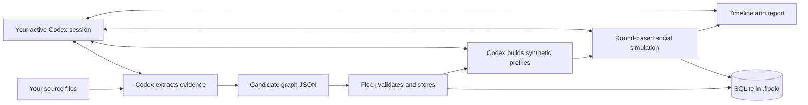

<div align="center">

# 🐦 Flock

### Evidence in. Possibilities out.

**A Codex plugin for knowledge graphs and synthetic social simulations.**

[Install](#install-in-codex) · [How it works](#how-it-works) · [Docs site](https://plilian.github.io/flock/) · [Privacy](#privacy-and-data) · [License](#license-and-attribution)


</div>

---

Flock helps you explore a question by grounding it in source material, mapping the relationships that matter, and simulating how a **synthetic** community could respond. You use it in Codex; the active Codex session handles language-model reasoning, while Flock stores the graph and run history in the workspace you choose.

Flock asks for **no LLM provider key and no Zep key**. Each person uses their own Codex sign-in and account limits.

> **A simulation is a structured thought experiment. It is not a poll, evidence about real people, or a forecast.**

## What Flock does

| Workflow | What it produces |
|---|---|
| **Source-grounded graph** | An ontology, cited entities, and typed relationships in a project-owned SQLite graph. |
| **Synthetic population** | Distinct agent profiles tied to graph entities, with assumptions marked separately from evidence. |
| **Social simulation** | Round-based Reddit-like or Twitter-like discussions, recorded actions, reactions, and timelines. |
| **Interactive run view** | A self-contained local HTML snapshot with round playback, the interaction graph, agent profiles, and a searchable event feed. |
| **Report and follow-up** | A Markdown report, activity statistics, graph questions, and clearly labeled synthetic-agent interviews. |

## How it works



Codex performs extraction, profile design, agent actions, and narrative analysis in the user's session. Flock's Python helper validates and stores graph/run data; it uses only the standard library and makes no network or model calls. There is **no separate web app to start**.

## Install in Codex

Requirements: Codex desktop or CLI with workspace/terminal access, a signed-in Codex account, and Python 3.11+.

```bash
codex plugin marketplace add plilian/flock
codex plugin add flock@flock
```

Open the workspace where Flock should keep its project data, then ask Codex:

```text
$flock Initialize a Flock project named “Transit study” in this workspace.
```

Use one Codex workspace folder per Flock project. The `.flock/` database in that workspace holds its graph and simulation history.

Use the plugin to build or update a graph, prepare an agent population, run a scenario, inspect the interactive timeline, or create a report. The run view is saved as `.flock/runs/<run_id>/visualization.html` and opens directly in a browser without a server. See the [installation and workflow guide](https://plilian.github.io/flock/docs.html).

## The graph and simulation engine

Flock replaces Zep with its own SQLite graph store. Entities retain stable IDs, typed attributes, and source references. Relationships are validated against those entities and citations before import.

For simulations, Codex proposes one action per synthetic agent per round. Flock checks the platform action schema and records the round in order. The built-in interaction engine supports:

- **Reddit-like:** posts, comments, votes, and community joins.
- **Twitter-like:** posts, replies, likes, reposts, and follows.
- **Analysis:** agent activity counts, engagement totals, event timelines, and Codex-written reports.

Flock keeps the graph and simulation mechanics in its own code. It does not depend on a Zep account or a MiroFish service.

## Privacy and data

- Codex receives the source excerpts and prompts needed for the workflow under the signed-in user's Codex account settings and policies.
- The Flock helper itself makes no network calls and does not access Codex credentials.
- Project data is stored under `.flock/` in the workspace selected by that user: a SQLite database, staging files, simulation records, reports, and self-contained HTML visualizations. No Flock-hosted service receives it.
- The repository `.gitignore` excludes `.flock/`; the helper adds an ignore rule inside `.flock/` for other Git workspaces.
- Source files remain where the user placed them. The graph stores source metadata and short citations, not full document copies.

## Repository layout

```text
plugins/flock/                    Codex plugin package
  plugin.json                     Plugin identity and install metadata
  skills/flock/SKILL.md           Codex workflow
  skills/flock/references/        Graph schema and simulation guide
  skills/flock/scripts/flock.py   Model-free graph, run store, and view generator
  skills/flock/scripts/visualizer_template.html  Offline interactive run view
site/                             Public landing page and separate setup docs
.agents/plugins/marketplace.json  GitHub-installable Codex marketplace
```

## Development

Run the helper directly from a checkout:

```bash
python plugins/flock/skills/flock/scripts/flock.py --help
```

Validate a workspace graph or simulation spec before importing/starting it:

```bash
python plugins/flock/skills/flock/scripts/flock.py --workspace . graph validate --input .flock/staging/graph.json
python plugins/flock/skills/flock/scripts/flock.py --workspace . simulation validate --spec .flock/staging/run.json
python plugins/flock/skills/flock/scripts/flock.py --workspace . simulation visualize --id <run_id>
```

The helper is model-free by design. New AI-dependent steps belong in the Codex skill workflow; do not add API-key settings or direct provider calls.

## License and attribution

Flock is released under **GNU Affero General Public License v3.0**; see [`LICENSE`](LICENSE). It is a substantially modified, independently maintained derivative of [MiroFish](https://github.com/666ghj/MiroFish). Attribution and project lineage are documented in [`ATTRIBUTION.md`](ATTRIBUTION.md). Flock is not endorsed by the original maintainers.

If you run a modified version of Flock for users over a network, AGPL-3.0 requires offering those users the corresponding source code. Third-party components remain subject to their own licenses.

---

<div align="center">

**Ask better questions about what could happen.**

[Install Flock](https://plilian.github.io/flock/docs.html#install) · [Browse the code](https://github.com/plilian/flock)

</div>
