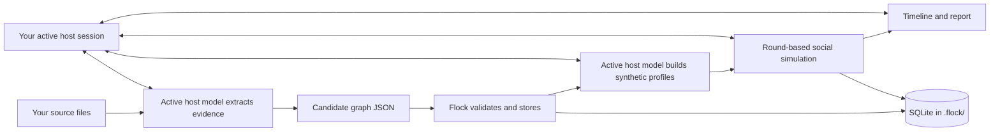

<div align="center">

# 🐦 Flock

### Evidence in. Possibilities out.

**A native plugin workflow for knowledge graphs and synthetic social simulations.**

[Install](#install-as-a-plugin) · [How it works](#how-it-works) · [Docs site](https://flock.daalgp.com/) · [Privacy](#privacy-and-data) · [License](#license-and-attribution)


</div>

---

Flock helps you explore a question by grounding it in source material, mapping the relationships that matter, and simulating how a **synthetic** community could respond. Native plugin packages are available for Codex, Claude Code, Gemini CLI, Qwen Code, and DeepSeek Harness. Each host's active model session handles reasoning; Flock stores the graph and run history in the workspace you choose.

Flock itself requires **no Flock API key, Zep key, or Flock account**. Model access remains with the host you choose: each user signs in or configures that host separately, and its data policies, plan, and usage limits apply; some host configurations may require their own provider credentials. DeepSeek Harness support targets its developer-preview plugin host, not DeepSeek's chat website or API.

> **A simulation is a structured thought experiment. It is not a poll, evidence about real people, or a forecast.**

## What Flock does

| Workflow | What it produces |
|---|---|
| **Source-grounded graph** | An ontology, cited entities, and typed relationships in a project-owned SQLite graph. |
| **Evidence Audit** | Citation coverage checks plus a host-model review for quote accuracy, contradictions, assumptions, and missing viewpoints. |
| **Synthetic population** | Distinct agent profiles tied to graph entities, with assumptions marked separately from evidence. |
| **Social simulation** | Round-based Reddit-like or Twitter-like discussions, recorded actions, reactions, and timelines. |
| **Scenario Lab** | Baseline-versus-alternative experiments with a shared synthetic roster, independent replicates, median/range comparisons, and an interactive replay. |
| **Interactive run view** | A self-contained local HTML snapshot with round playback, the interaction graph, agent profiles, and a searchable event feed. |
| **Report and follow-up** | A Markdown report, activity statistics, graph questions, and clearly labeled synthetic-agent interviews. |

## How it works



The active host performs extraction, profile design, agent actions, and narrative analysis in the user's session. Flock's Python helper validates and stores graph/run data; it uses only the standard library and makes no network or model calls. There is **no separate web app to start**.

Each graph record has an evidence status: `observed`, `inferred`, `assumption`, or `unclassified`. The audit checks citation structure, then asks the active host to review source meaning. Scenario Lab starts every variant with the same profiles and an empty feed; its replicate ranges describe only the configured synthetic runs, not real-world odds.

## Install as a plugin

All integrations use the host model available in that product. Flock packages install directly from GitHub; they are not yet vendor-directory listings. Flock does not collect or forward sign-in credentials. Python 3.11+ and workspace/terminal access are required.

### Codex

```bash
codex plugin marketplace add plilian/flock
codex plugin add flock@flock
```

### Claude Code

```bash
claude plugin marketplace add plilian/flock
claude plugin install flock@flock
```

### Gemini CLI

```bash
gemini extensions install https://github.com/plilian/flock
```

### Qwen Code

```bash
qwen extensions install https://github.com/plilian/flock
```

### DeepSeek Harness

DeepSeek Harness is a separate, developer-preview plugin host. Clone the repository, then install its bundle into a Harness profile:

```bash
git clone https://github.com/plilian/flock.git
cd flock
dsh plugin --profile web add ./plugins/deepseek-harness
```

This integration is for DeepSeek Harness, not the DeepSeek chat website or API. Harness model access follows its own provider configuration and may require additional setup.

Open a project workspace in your chosen host and ask its agent to use Flock, for example:

```text
Use Flock to initialize a project named “Transit study” in this workspace.
```

Use one workspace folder per Flock project. The `.flock/` database in that workspace holds its graph and simulation history. Ask the agent to build or update a graph, prepare a synthetic population, run a scenario, inspect the interactive timeline, or create a report. The run view is saved as `.flock/runs/<run_id>/visualization.html` and opens directly in a browser without a server. See the [installation and workflow guide](https://flock.daalgp.com/docs.html).

## The graph and simulation engine

Flock replaces Zep with its own SQLite graph store. Entities retain stable IDs, typed attributes, and source references. Relationships are validated against those entities and citations before import.

For simulations, the active host model proposes one action per synthetic agent per round. Flock checks the platform action schema and records the round in order. The built-in interaction engine supports:

- **Reddit-like:** posts, comments, votes, and community joins.
- **Twitter-like:** posts, replies, likes, reposts, and follows.
- **Analysis:** agent activity counts, engagement totals, event timelines, and host-model-written reports.

Flock keeps the graph and simulation mechanics in its own code. It does not depend on a Zep account or a MiroFish service.

## Privacy and data

- The selected host processes the source excerpts and prompts under its own account, provider, and data policies. Review the host's settings before sharing sensitive source material.
- The Flock helper itself makes no network calls and does not access host credentials.
- Project data is stored under `.flock/` in the workspace selected by that user: a SQLite database, staging files, evidence audit files, scenario experiments, simulation records, reports, and self-contained HTML visualizations. No Flock-hosted service receives it.
- The repository `.gitignore` excludes `.flock/`; the helper adds an ignore rule inside `.flock/` for other Git workspaces.
- Source files remain where the user placed them. The graph stores source metadata and short citations, not full document copies.

## Repository layout

```text
plugins/flock/                    Codex plugin package
  plugin.json                     Plugin identity and install metadata
  skills/flock/SKILL.md           Shared Flock workflow
  skills/flock/references/        Graph schema and simulation guide
  skills/flock/scripts/flock.py   Model-free graph, run store, and view generator
  skills/flock/scripts/visualizer_template.html  Offline interactive run view
  skills/flock/scripts/experiment_visualizer_template.html  Offline Scenario Lab comparison view
plugins/claude/                   Claude Code plugin package
plugins/deepseek-harness/         DeepSeek Harness bundle (developer preview)
skills/flock/                     Gemini CLI and Qwen Code skill package
gemini-extension.json             Gemini CLI extension manifest
qwen-extension.json               Qwen Code extension manifest
.claude-plugin/marketplace.json   Claude Code marketplace
.agents/plugins/marketplace.json  Codex marketplace
site/                             Public landing page and setup documentation
```

## Development

Run the helper directly from a checkout:

```bash
python plugins/flock/skills/flock/scripts/flock.py --help
```

Validate a workspace graph or simulation spec before importing/starting it:

```bash
python plugins/flock/skills/flock/scripts/flock.py --workspace . graph validate --input .flock/staging/graph.json
python plugins/flock/skills/flock/scripts/flock.py --workspace . graph audit
python plugins/flock/skills/flock/scripts/flock.py --workspace . simulation validate --spec .flock/staging/run.json
python plugins/flock/skills/flock/scripts/flock.py --workspace . simulation visualize --id <run_id>
python plugins/flock/skills/flock/scripts/flock.py --workspace . scenario validate --spec .flock/staging/experiment.json
python plugins/flock/skills/flock/scripts/flock.py --workspace . scenario create --spec .flock/staging/experiment.json
python plugins/flock/skills/flock/scripts/flock.py --workspace . scenario compare --id <experiment_id>
python plugins/flock/skills/flock/scripts/flock.py --workspace . scenario visualize --id <experiment_id>
python plugins/flock/skills/flock/scripts/flock.py --workspace . scenario save-report --id <experiment_id> --input .flock/staging/report.md
```

The helper is model-free by design. New AI-dependent steps belong in the host's Flock skill workflow; do not add API-key settings or direct provider calls.

## License and attribution

Flock is released under **GNU Affero General Public License v3.0**; see [`LICENSE`](LICENSE). It is an independently maintained, substantially modified derivative of [MiroFish](https://github.com/666ghj/MiroFish). Flock replaces the earlier web-app delivery and Zep-backed graph workflow with native agent-host plugins and a workspace-local SQLite graph. Attribution and project lineage are documented in [`ATTRIBUTION.md`](ATTRIBUTION.md). Flock is not affiliated with or endorsed by the original maintainers.

If you run a modified version of Flock for users over a network, AGPL-3.0 requires offering those users the corresponding source code. Third-party components remain subject to their own licenses.

---

<div align="center">

**Ask better questions about what could happen.**

[Install Flock](https://flock.daalgp.com/docs.html#install) · [Browse the code](https://github.com/plilian/flock)

</div>


